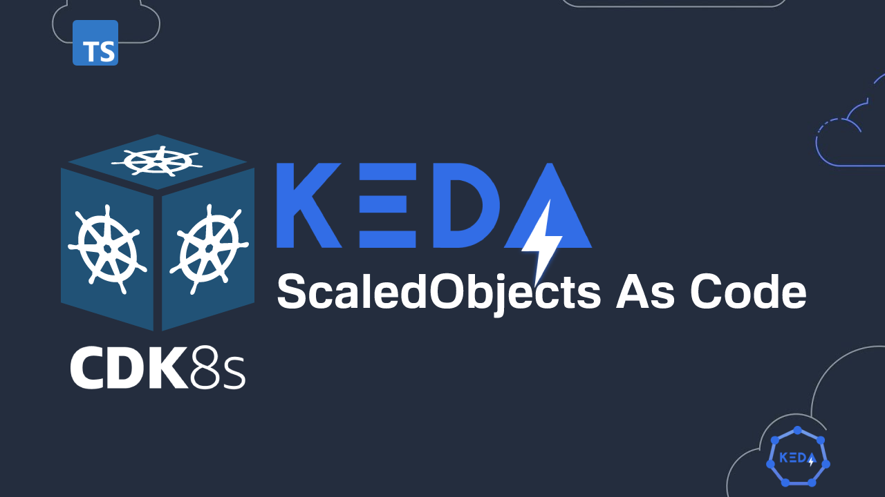

<p align="center">
  <a href="https://dev.to/vumdao">
    
  </a>
</p>
<h1 align="center">
  <div><b>Keda ScaledObject As Code Using CDK8S</b></div>
</h1>

## Abstract
- [keda](https://keda.sh/) is Kubernetes Event-driven Autoscaling and it's been used wisely now. In this blog, it provides the way to create Keda scaledobject CRD as code using [CDK8S](https://cdk8s.io/) typescript.
- With importing Keda CRDs and using CDK8S you can create Keda scaledobjects using your familiar programming languages such as typescript as scale.

## Table Of Contents
 * [Pre-requisite](#Pre-requisite)
 * [Overview of Keda](#Overview-of-Keda)
 * [Import Keda CRDs](#Import-Keda-CRDs)
 * [Write code](#Write-code)
 * [Build keda scaledobjects from code](#Build-keda-scaledobjects-from-code)
 * [Apply and test](#Apply-and-test)
 * [Conclusion](#Conclusion)

---

## 🚀 **Pre-requisite** <a name="Pre-requisite"></a>
- Install typescript, node, and cdk8s as well as projen (optional) which is a tool of managing project configuration as code.
- [Getting started with cdk8s](https://cdk8s.io/docs/latest/getting-started/)

## 🚀 **Overview of Keda** <a name="Overview-of-Keda"></a>


- KEDA works alongside standard Kubernetes components like the Horizontal Pod Autoscaler and can extend functionality without overwriting or duplication.
- KEDA supports multiple triggers within an Scaledobject. Each trigger is exposed split as a metric and the HPA Controller does a MAX between all the metrics.

## 🚀 **Import Keda CRDs** <a name="Import-Keda-CRDs"></a>
- Keda does not provide its CRDs separately so we can found the manifest in GH release section. Here I import the current latest version of keda v2.8.0 and out the `imports` folder in `src/imports`

  ```
  ⚡ $ cdk8s import https://github.com/kedacore/keda/releases/download/v2.8.0/keda-2.8.0.yaml --output src/imports/
  ------------------------------------------------------------------------------------------------
  A new version 2.0.88 of cdk8s-cli is available (current 2.0.13).
  Run "npm install -g cdk8s-cli" to install the latest version on your system.
  For additional installation methods, see https://cdk8s.io/docs/latest/getting-started
  ------------------------------------------------------------------------------------------------
  Importing resources, this may take a few moments...
  keda.sh
    keda.sh/clustertriggerauthentication
    keda.sh/scaledjob
    keda.sh/scaledobject
    keda.sh/triggerauthentication
  ```

- Import result
  ```
  ⚡ $ tree src/imports/
  src/imports/
  └── keda.sh.ts

  0 directories, 1 file
  ```

## 🚀 **Write code** <a name="Write-code"></a>
- It's much more convinient to use visual code writing KEDA scaledobject in typescript language. We can read the document and find all references of construct, objects and properties of KEDA CRDs
- This blog provides the usecase of creating scaledObject (SO) for Apache airflow worker component. It contains 3 triggers (Scalers) in the SO
  1. [Cron](https://keda.sh/docs/2.8/scalers/cron/) - Scale applications based on a cron schedule.
    Airflow server scheduled pipelines and worker components are scaled out at that time, but it takes time to start node, join node to cluster and Pod ready (about 2-3mins) so we use cron to pre-scale workers

  2. [PostgreSQL](https://keda.sh/docs/2.8/scalers/postgresql/) - Scale applications based on a PostgreSQL query.
    - This scaler bases on the output of query command to scaleout works, here we count the number of running/queued airflow task instances belongs to scheduled pipeline (eg. running reports). Divide the count number to Airflow worker concurrency (eg. 16 as default)
    - `targetQueryValue: '1.5'` - The result of above calculation divide to this target value to decide how many pods will be scaled out

  3. [CPU](https://keda.sh/docs/2.8/scalers/cpu/) - Scale applications based on cpu metrics
    - This is optional as it ensure provisioning workers when CPU Utilization is higher than 80%

- PostgreSQL Scaler requires `TriggerAuthentication` to provide password of airflow user in order to query the database. The credential is get from K8S secret `airflow-secret` within the `airflow` namespace
  ```
    const pgAuth = new TriggerAuthentication(this, 'KedaPostgresAuthentication', {
      metadata: {
        name: 'keda-airflow-postgresql-auth',
        namespace: 'airflow',
      },
      spec: {
        secretTargetRef: [{
          parameter: 'password',
          name: 'airflow-secret',
          key: 'postgresql-password',
        }],
      },
    });
  ```

- Some SO specs need to know
  - `pollingInterval`: This is the interval to check each trigger on. By default KEDA will check each trigger source on every ScaledObject every 30 seconds. So to reduce the query connections/workload to airflow database we need to care this vaule.
  - `cooldownPeriod`: The period to wait after the last trigger reported active before scaling the resource back to 0.

## 🚀 **Build keda scaledobjects from code** <a name="Build-keda-scaledobjects-from-code"></a>
- Source code:
  ```
  ⚡ $ tree src/
  src/
  ├── imports
  │   └── keda.sh.ts
  ├── keda-airflow.ts
  └── main.ts

  1 directory, 3 files
  ```

- Build resource
  ```
  ⚡ $ npx projen build
  👾 build » default | ts-node --project tsconfig.dev.json .projenrc.ts
  👾 build » compile | tsc --build
  👾 build » post-compile » synth | cdk8s synth
  No manifests synthesized
  👾 build » test | jest --passWithNoTests --all --updateSnapshot
  No tests found, exiting with code 0
  ----------|---------|----------|---------|---------|-------------------
  File      | % Stmts | % Branch | % Funcs | % Lines | Uncovered Line #s
  ----------|---------|----------|---------|---------|-------------------
  All files |       0 |        0 |       0 |       0 |
  ----------|---------|----------|---------|---------|-------------------
  👾 build » test » eslint | eslint --ext .ts,.tsx --fix --no-error-on-unmatched-pattern src test build-tools projenrc .projenrc.ts
  ```

- Manifest yaml file
  ```
  ⚡ $ tree dist/
  dist/
  └── keda
      └── airflow-keda-so.yaml

  1 directory, 1 file
  ```

## 🚀 **Apply and test** <a name="Apply-and-test">
- Apply manifest and check result
  ```
  # k apply -f

  # k get so -n airflow
  NAME               SCALETARGETKIND       SCALETARGETNAME   MIN   MAX   TRIGGERS   AUTHENTICATION                 READY   ACTIVE   FALLBACK   AGE
  airflow-worker-1   apps/v1.StatefulSet   airflow-worker    2     12    cron       keda-airflow-postgresql-auth   True    True     False      2d21h

  # k get hpa -n airflow
  NAME                        REFERENCE                    TARGETS                                  MINPODS   MAXPODS   REPLICAS   AGE
  keda-hpa-airflow-worker-1   StatefulSet/airflow-worker   500m/1 (avg), 500m/1 (avg) + 2 more...   2         12        2          2d21h
  ```

## 🚀 Conclusion <a name="Conclusion"></a>
- Within the Scaledobject class, you can jump to definition to understand the meaning of each properties and also know which required/optional attributes.
- We can create a custom construct and base on that to provision multiple KEDA scaledobjects with customize specs/meta such as min/max/desired replicas, triggers, trigger authentication, etc.